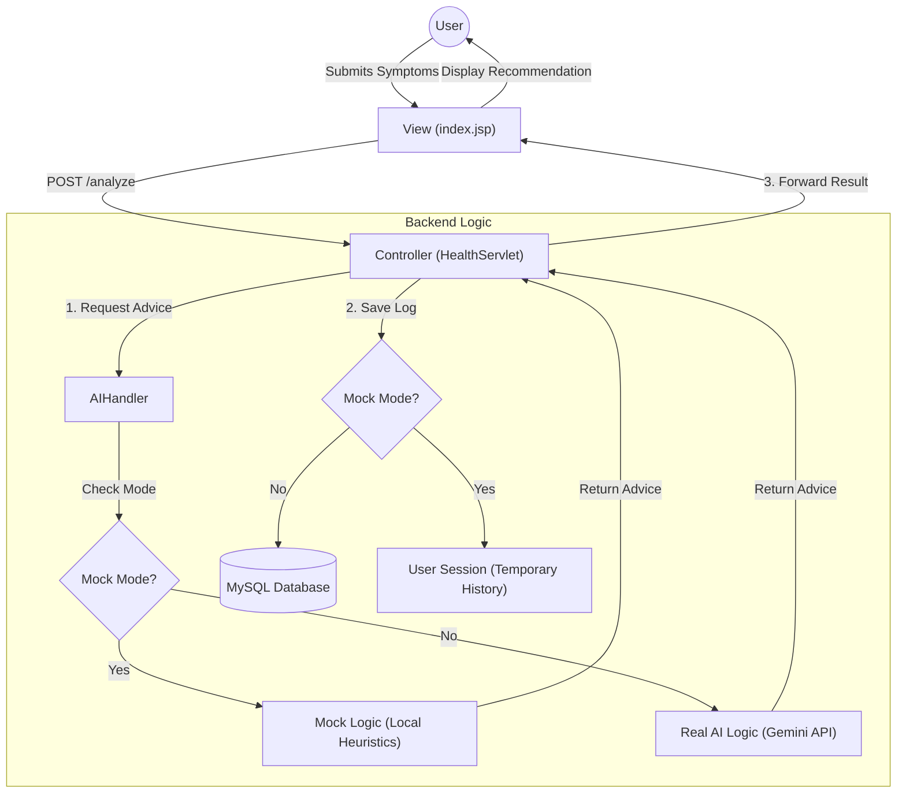

# System Architecture

## Overview
The **AI Health Assistant** follows a strict **Model-View-Controller (MVC)** architecture. It is designed with a unique "Dual-Mode" system to ensure it runs reliably in both development (Mock Mode) and production (Real Mode) environments.

## Architecture Diagram

## Component Breakdown

### 1. View (Frontend)
-   **Files:** `index.jsp`, `style.css`
-   **Role:** Handles user interaction. It sends symptom data to the server and displays the returned health advice.
-   **Preview Mode:** A standalone `preview.html` exists to simulate this behavior entirely in the browser without a backend server.

### 2. Controller (Backend)
-   **File:** `HealthServlet.java`
-   **Role:** The central coordinator.
    -   Receives input from the View.
    -   Delegates logic to the `AIHandler`.
    -   Decides whether to persist data to MySQL or just Session memory based on the mode.
    -   Returns the final result to the View.

### 3. Model (Logic & Data)
-   **AI Logic (`AIHandler.java`):**
    -   **Real Mode:** Connects to Google's Gemini API for dynamic medical analysis.
    -   **Mock Mode:** Uses keyword matching (e.g., "fever" -> "Rest and hydrate") to simulate AI responses instantly.
-   **Data Persistence (`DBConnection.java`):**
    -   **Real Mode:** Connects to a local MySQL database (`health_logs` table).
    -   **Mock Mode:** Bypasses the database to prevent connection errors during demonstrations.
